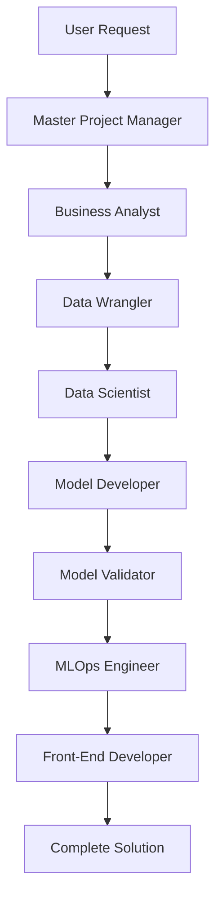

# Domino Data Lab Claude Code Agents

## 📋 Overview

This collection of Claude Code agents provides comprehensive support for building end-to-end machine learning demonstrations on the Domino Data Lab platform. Each agent specializes in a specific aspect of the ML lifecycle, and they work together to create production-ready solutions.

## 🎯 Agent Roles & Responsibilities

### Core Orchestration
- **Master-Project-Manager-Agent** (purple): Orchestrates all other agents, manages workflows, and ensures project success

### Data & Analysis
- **Data-Wrangler-Agent** (red): Finds or generates data, manages data quality, and creates data pipelines
- **Data-Scientist-Agent** (blue): Performs exploratory data analysis, creates visualizations, and generates insights

### Model Development
- **Model-Developer-Agent** (orange): Develops, trains, and optimizes ML models using various frameworks
- **Model-Validator-Agent** (indigo): Validates model performance, tests robustness, and ensures production readiness

### Requirements & Deployment
- **Business-Analyst-Agent** (green): Translates business needs into technical requirements and success metrics
- **MLOps-Engineer-Agent** (yellow): Creates deployment pipelines, monitoring, and production infrastructure
- **Front-End-Developer-Agent** (cyan): Builds user interfaces and dashboards with optimal technology selection

### Documentation
- **Agent-Interaction-Protocol**: Reference for how agents communicate with each other
- **Example-Demonstration-Flows**: Sample workflows showing file organization and MLflow integration

## 🔄 Typical Workflow



## 📁 File Organization

All agents follow a standardized directory structure:

```
/mnt/
├── code/{stage}/           # Scripts, notebooks, requirements
├── artifacts/{stage}/      # Models, reports, visualizations
└── data/{project}/{stage}/ # Project-specific datasets
```

## 🚀 Getting Started

### Basic Usage

1. **Simple Model Development**:
   - Start with Data-Wrangler-Agent to acquire data
   - Use Data-Scientist-Agent for EDA
   - Deploy Model-Developer-Agent for training

2. **Full Pipeline**:
   - Use Master-Project-Manager-Agent
   - It will orchestrate all other agents automatically

### Example Commands

```python
# For a quick demo
"Create a credit risk model demo with synthetic data"

# For comprehensive pipeline
"Build an end-to-end customer churn prediction system with dashboard"

# For specific tasks
"Generate synthetic financial data for fraud detection"
"Perform EDA on this dataset and create visualizations"
"Deploy this model with monitoring and A/B testing"
```

## 🔧 Key Features

### MLflow Integration
- All agents log experiments, metrics, and artifacts to MLflow
- Parent-child run hierarchy for complex workflows
- Model registry with signatures and input examples
- Comprehensive tracking of all pipeline stages

### Technology Stack
- **Primary Language**: Python for all ML operations
- **ML Frameworks**: scikit-learn, XGBoost, LightGBM, TensorFlow, PyTorch
- **UI Frameworks**: Streamlit, Dash, Gradio, Panel, React/FastAPI
- **Deployment**: FastAPI, Flask, Docker, Domino Flows

### Error Handling
- Graceful degradation with fallback strategies
- Comprehensive logging and monitoring
- Retry logic with exponential backoff
- Clear error messages and remediation steps

## 📊 Output Standards

Each agent produces:
- Python notebooks with documentation
- Production-ready Python scripts
- Requirements.txt for dependencies
- MLflow experiments with full tracking
- JSON test data for validation
- Comprehensive documentation

## 🎯 Best Practices

1. **Always specify project name** for proper organization
2. **Use descriptive experiment names** in MLflow
3. **Include business context** for better recommendations
4. **Enable MLflow tracking** for reproducibility
5. **Test with small datasets first** before scaling

## 💡 Tips for Sales Engineers

- Start with the Master-Project-Manager-Agent for complete demos
- Use individual agents for specific customer pain points
- Leverage the Front-End-Developer-Agent's technology recommendations
- Always generate test data with the Data-Wrangler-Agent
- Use Model-Validator-Agent to showcase governance capabilities

## 📝 Notes

- All agents prioritize Python for consistency
- Agents automatically handle directory creation
- MLflow integration is built into all workflows
- Error handling ensures demos never fail completely
- Each agent can work independently or as part of a pipeline

## 🔗 Dependencies

Core Python packages required:
- pandas, numpy, scikit-learn
- mlflow, optuna, joblib
- streamlit, dash, gradio
- fastapi, flask
- xgboost, lightgbm
- plotly, seaborn, matplotlib

## 📚 Additional Resources

- Review `Agent-Interaction-Protocol.md` for communication patterns
- Check `Example-Demonstration-Flows-With-File-Structure.md` for workflow examples
- Each agent file contains detailed system prompts and key methods
- All agents follow Domino Data Lab best practices